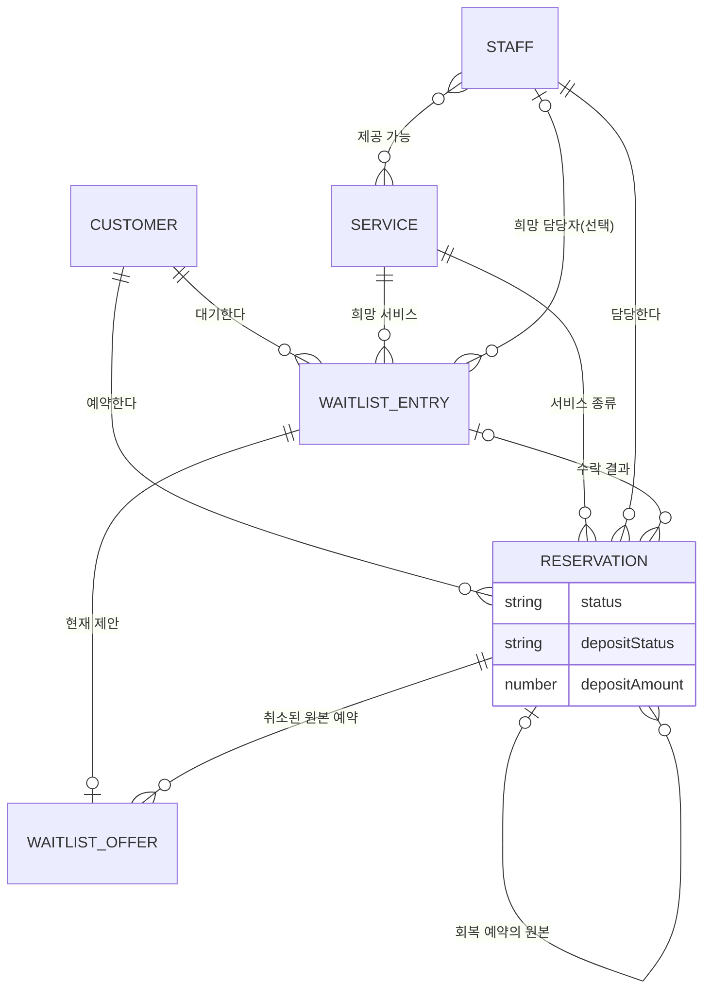
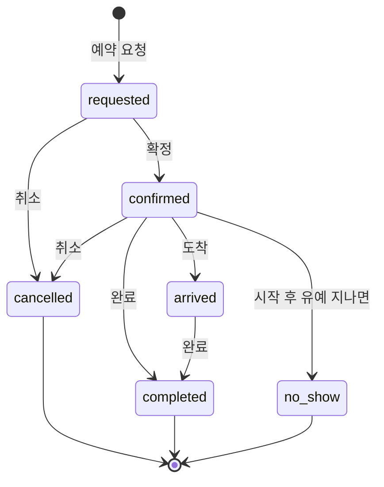
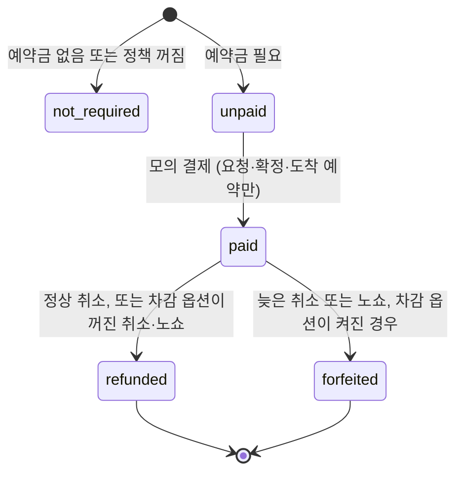

# BUSINESS_MODEL · 예약·노쇼·취소 빈자리 회복

> 이 앱이 가르치는 **실제 예약 비즈니스의 구조**를 정리한 문서입니다. 규칙과 숫자는 `src/domain/`의 현재 코드를 기준으로 적었고, 코드가 업무상 어색하게 동작하는 곳은 "⚠ 현재 코드 동작"으로 따로 표시했습니다(자세한 위험 목록은 `PROJECT_STATE.md`).
>
> 마지막 갱신: 2026-09-30 (코드 기준 commit `21da4f4`, P0-3 예약금 상태 무결성 반영)

## 1. 누가 돈을 내고, 누가 쓰는가

예약 사업에는 서로 다른 세 부류가 있습니다.

| 역할 | 누구 | 이 사업 구조에서의 위치 |
|---|---|---|
| **돈을 내는 고객 (도구의 구매자)** | 예약으로 매출이 나는 매장의 점주·사업자 (미용실, 병원, 스튜디오, 상담소 등) | 노쇼와 늦은 취소로 잃는 매출을 줄이기 위해 예약 운영 도구에 비용을 낼 사람입니다. *지불 의사와 금액은 아직 검증되지 않은 가정입니다.* |
| **서비스를 사는 손님** | 예약하는 최종 고객 | 서비스 요금과 예약금을 **매장에** 냅니다. 도구에 돈을 내지 않습니다. 이 앱에서는 `Customer`입니다. |
| **실제 운영자 (매일 쓰는 사람)** | 실장, 프런트 직원, 예약 담당자 | 예약 접수, 예약금 확인, 취소·노쇼 처리, 대기자 연락을 매일 합니다. 이 앱의 화면을 직접 조작하는 사람입니다. |

서비스를 제공하는 사람(디자이너, 의사 등)은 이 앱에서 `Staff`입니다. 운영자와 같은 사람일 수도 있습니다. 이 앱에는 로그인과 역할이 없어서 한 사람이 모든 역할을 합니다.

## 2. 핵심 문제

1. **빈 시간은 되살릴 수 없는 손실입니다.** 인건비와 임대료는 예약이 취소돼도 그대로 나가는데, 그 시간의 매출은 사라집니다.
2. **노쇼와 늦은 취소는 예고 없이 옵니다.** 일찍 취소하면 다른 손님을 받을 수 있지만, 임박한 취소는 채울 시간이 없습니다.
3. **빈자리를 사람이 채우면 느리고 놓칩니다.** 누가 그 시간·서비스·담당자를 원하는지 기억하고 연락하는 일은 수작업으로 하기 어렵습니다.
4. **예약금 정책이 불명확하면 분쟁이 납니다.** 언제까지 취소하면 돌려주는지, 노쇼면 어떻게 하는지가 규칙으로 정해져 있어야 합니다.
5. **중복 예약은 신뢰를 잃게 합니다.** 같은 담당자의 같은 시간에 두 예약이 잡히면 안 됩니다.

이 앱의 답: **예약금 + 취소 정책으로 손실을 줄이고, 그래도 생긴 빈자리는 대기자 제안으로 되살립니다.**

## 3. 핵심 업무 흐름

```text
예약 요청 → 예약금 → 확정 → 방문(도착) → 완료
                         ↘ 취소(도착 전) ──→ 빈자리 ──→ 대기자 매칭 → 제안(홀드) → 수락 ──→ 회복 예약(예약금 필요 시 요청→결제→확정)
                         ↘ 노쇼(확정 예약, 유예 시간 이후)                             ↘ 거절/만료 → 다시 대기
                                                       모든 변경 → 감사 이력, 결과 → 리포트
```

| 단계 | 하는 일 | 코드 |
|---|---|---|
| 1. 예약 확보 | 서비스·담당자·시간을 정하고 영업시간, 담당자의 서비스 제공 여부, 담당자 일정 겹침을 검사합니다. | `bookingCheck`, `createReservation` |
| 2. 예약금과 확정 | 예약금이 필요하게 만들어진 예약은 `unpaid → paid` 뒤에 `requested → confirmed`가 됩니다. 확정할 때 겹침을 다시 검사합니다. 예약금 필요 여부는 예약 생성 시점에 정해지고 그 뒤 정책 스위치로 바뀌지 않습니다. | `payDeposit`, `confirmReservation` |
| 3. 방문 결과 | 확정 예약은 도착 → 완료, 또는 시작 + 유예 시간이 지나면 노쇼가 됩니다. 노쇼는 확정 예약만 기록할 수 있습니다. | `markArrived`, `completeReservation`, `markNoShow` |
| 4. 취소 | 요청·확정 예약만 취소할 수 있습니다(도착 이후는 불가). 실습 시각과 시작 시각의 차이로 정상/늦은 취소를 판단하고 예약금을 환불 또는 차감합니다. | `cancellationDecision`, `cancelReservation` |
| 5. 빈자리 회복 | 취소된 예약은 일정을 점유하지 않습니다. 조건이 맞는 대기자를 찾아 제안합니다. | `waitlistMatches`, `offerCancelledSlot` |
| 6. 수락 전 재검사 | 제안 뒤 다른 예약이 들어왔을 수 있으므로 수락할 때 다시 검사한 뒤 새 예약을 만듭니다. 예약금이 필요하면 `requested` + `unpaid`로 만들고 결제 후 확정합니다. | `acceptOffer` |
| 7. 결과 측정 | 지표와 감사 이력으로 무슨 일이 있었는지 봅니다. | `metrics`, `audit` |

## 4. 자료 사이의 관계



| 자료 | 핵심 필드 | 관계와 규칙 |
|---|---|---|
| `Customer` | 이름, 연락처(가상), `visitCount`, `noShowCount` | 예약·대기자의 주인. 완료하면 방문 +1, 노쇼하면 노쇼 +1 |
| `Service` | 소요 시간, 버퍼, 가격, 예약금, 활성 여부 | 예약이 끝나는 시각 = 시작 + 소요 시간 + 버퍼 |
| `Staff` | 제공 가능한 서비스 목록, 활성 여부 | 자기가 제공하지 않는 서비스는 받을 수 없음. 일정 겹침 검사의 단위 |
| `Reservation` | 고객·서비스·담당자, 시작·종료, `status`, `depositStatus`, `depositAmount`, `source`, 취소 사유·시각 | 예약금은 별도 자료가 아니라 **예약 안의 필드**이고, 예약금 필요 여부와 금액은 **예약을 만들 때 고정**됩니다. `recoveredFromReservationId`(원본 취소 예약)와 `waitlistId`(수락한 대기자)로 회복 흐름을 추적 |
| `WaitlistEntry` | 희망 서비스, 희망 시간 범위, 희망 담당자(없으면 아무나), `status` (`waiting`, `offered`, `booked`. `expired`와 `removed`는 타입에 정의돼 있지만 현재 엔진은 만들지 않음) | 대기자 한 명당 제안 객체는 **하나뿐**이라 다시 제안하면 이전 제안이 덮어써집니다(이전 제안의 기록은 감사 이력에만 남습니다) |
| `WaitlistOffer` | 제안 슬롯, 발송·만료 시각, `status`, 원본 취소 예약 | 대기자 안에 들어 있는 객체 |
| `Policy` | 영업시간, 슬롯 분, 취소 기준 시간, 노쇼 유예, 제안 홀드, 예약금·차감 옵션 | 앱 전체에 하나. 값 범위는 `policy.ts`가 검증(P0-1) |
| `AuditEntry` | 시각, 종류, 대상 ID, 설명 | 상태를 바꾸는 명령마다 한 줄. 대상 ID는 예약·대기자 외에 `policy`, `clock`, `customers` 같은 문자열도 쓰는 느슨한 참조 |
| `AppState` | 위 전부 + 가상 시각 + 버전 | localStorage에 통째로 저장 |

`source`는 예약의 출처입니다: `manual`(사람이 입력), `csv`(가져오기), `waitlist`(빈자리 회복), `practice`(실습 시드).

## 5. 예약 상태 전이



| 현재 상태 | 동작 | 다음 상태 | 조건 (현재 코드) |
|---|---|---|---|
| (없음) | 예약 요청 | `requested` | 서비스·담당자 활성, 담당자가 서비스 제공, 영업시간 안, 담당자 일정 겹침 없음 |
| `requested` | 확정 | `confirmed` | 예약의 `depositStatus`가 `unpaid`이면 확정할 수 없음(먼저 모의 결제). 예약금 필요 여부는 정책 스위치가 아니라 예약에 고정된 상태로 판단. 겹침 재검사 |
| `confirmed` | 도착 | `arrived` | |
| `confirmed`, `arrived` | 완료 | `completed` | 고객 방문 +1 |
| `requested`, `confirmed` | 취소 | `cancelled` | 예약금 처리는 6번 참고. `arrived`는 일반 취소 불가 |
| `confirmed` | 노쇼 | `no_show` | 현재 시각 ≥ 시작 + 노쇼 유예. 고객 노쇼 +1. `requested`와 `arrived`는 시간이 지나도 노쇼 불가 |
| `cancelled`, `completed`, `no_show` | - | 끝 | 더 바뀌지 않음(취소도 예약금 결제도 불가) |

도착(`arrived`) 이후에는 완료만 가능합니다. 도착 처리를 잘못 눌렀을 때 되돌리는 기능은 아직 없습니다.

일정을 차지하는 상태는 `cancelled`와 `no_show`를 **뺀** 나머지입니다. 취소·노쇼는 그 시간을 비웁니다.

## 6. 예약금 상태 전이와 취소·노쇼 규칙



| 시점 | 예약금 상태 변화 |
|---|---|
| 예약 생성 | 그 시점에 정책이 예약금을 요구하고 서비스 예약금이 0보다 크면 `unpaid`(금액 = 서비스 예약금), 아니면 `not_required`(금액 0). **이 결정은 예약에 고정**되어, 이후 정책의 예약금 스위치를 켜고 꺼도 기존 예약은 바뀌지 않습니다 |
| 모의 결제 | `unpaid → paid` (`paid` 뒤에는 다시 처리 불가). 취소·완료·노쇼된 예약에는 결제할 수 없고, 요청·확정·도착 예약에서만 됩니다 |
| **취소** | `paid`일 때만 바뀝니다. **늦은 취소이고 "늦은 취소 시 차감" 옵션이 켜져 있으면 `forfeited`**, 그 외(정상 취소, 또는 옵션 꺼짐)는 `refunded`. `unpaid`/`not_required`는 그대로. `arrived` 예약은 취소할 수 없음 |
| **노쇼** | 확정 예약만 노쇼가 되고, `paid`이면 "노쇼 시 차감" 옵션이 켜져 있을 때 `forfeited`(모의 차감), 꺼져 있으면 `refunded`(모의 환불). 감사 이력에 어느 쪽인지 적힘. `paid`가 아니면 예약금은 그대로 |
| 완료 | 예약금 상태를 바꾸지 않음(`paid` 유지) |
| 대기자 수락으로 생긴 회복 예약 | 그 시점에 정책이 예약금을 요구하고 서비스 예약금이 있으면 `requested` + `unpaid`(모의 결제 뒤 확정, 미결제 상태에서도 그 시간을 점유), 아니면 곧바로 `confirmed` + `not_required` |

⚠ **아직 남은 한계.** ① 예약금 필요 여부와 금액은 예약에 고정되지만, 취소 기준 시간·늦은 취소 차감·노쇼 차감 옵션은 사건이 일어난 시점의 정책으로 계산합니다. 정책을 바꾸면 이미 만든 예약의 취소·노쇼 결과가 달라질 수 있습니다(`PROJECT_STATE.md` P1-1). ② 이 규칙은 앞으로 만드는 상태에만 적용됩니다. P0-3 이전에 저장된 데이터나 백업에 들어 있는 모순 조합(`cancelled` + `paid` 등)은 정리하지 않았고 복원 검증도 통과합니다(`PROJECT_STATE.md` D7, 열린 항목).

### 취소 규칙 (`cancellationDecision`)

- 이미 `cancelled`, `completed`, `no_show`인 예약은 취소할 수 없고, 도착 처리된 `arrived` 예약도 일반 취소할 수 없습니다.
- `취소 시점까지 남은 시간 = (예약 시작 − 현재 실습 시각)`을 시간 단위로 계산합니다.
- 남은 시간이 **취소 기준 시간(기본 24시간)보다 작으면 늦은 취소**입니다.
- 예: 기준 24시간, 예약이 5시간 뒤 → 늦은 취소. 예약금이 `paid`이고 차감 옵션이 켜져 있으면 `forfeited`, 꺼져 있으면 `refunded`. 3일 뒤 취소는 정상 취소라 `refunded`입니다.
- 취소해도 고객의 방문·노쇼 횟수는 바뀌지 않습니다.

### 노쇼 규칙 (`canMarkNoShow`)

- **`confirmed`** 이고 **현재 실습 시각 ≥ 예약 시작 + 노쇼 유예(기본 10분)** 일 때만 기록할 수 있습니다. 확정되지 않은 `requested` 예약과 도착한 `arrived` 예약은 시간이 지나도 노쇼가 되지 않습니다.
- 기록하면 예약은 `no_show`가 되어 그 시간이 비고, 고객 노쇼 횟수가 1 늘어납니다. 결제된 예약금은 "노쇼 시 차감" 옵션에 따라 모의 차감 또는 모의 환불됩니다.

### 정책 기본값

영업시간 9~19시, 슬롯 30분, 취소 기준 24시간, 노쇼 유예 10분, 제안 홀드 20분, 예약금 사용·늦은 취소 차감·노쇼 차감 모두 켬. 값이 허용 범위를 벗어나면 저장되지 않습니다(P0-1: 슬롯 5~240 정수, 시작 시 0~23 정수, 종료 시 1~24 정수이며 시작 < 종료, 취소 기준 0~8760, 노쇼 유예 0~1440, 제안 홀드 0 초과 10080 이하).

## 7. 빈자리 회복 방식

```text
예약 취소 ─→ 빈자리(취소된 예약의 서비스·담당자·시간)
              │
              ▼
   대기자 매칭: status가 waiting 이고
     ① 같은 서비스  ② 희망 담당자가 없거나 같은 담당자
     ③ 희망 시간 범위가 빈자리 전체를 포함
              │
              ▼
   제안(모의): 대기자 status = offered, 제안 status = open, 만료 = 현재 + 홀드 분
              │
      ┌───────┼──────────────┐
   수락       거절            만료(현재 시각 > 만료 시각)
      │        │               │
 겹침 재검사   제안 declined    제안 expired
 통과하면     대기자 waiting    대기자 waiting
 새 예약 생성 (source waitlist,
  예약금 필요 시 requested + unpaid,
  아니면 confirmed,
  원본 예약·대기자 ID 기록)
 대기자 booked, 제안 accepted
```

- 수락하기 전에 만료된 제안을 먼저 정리한 뒤 다시 겹침을 검사합니다. 검사에 실패하면 예약을 만들지 않고 오류를 보여 줍니다.
- 예약금이 필요한 회복 예약은 수락 즉시 확정되지 않습니다. `requested` + `unpaid`로 생기고, 예약 관리에서 모의 결제한 뒤 확정합니다. 결제 전에도 그 시간은 점유됩니다. 예약금이 필요 없는 경우(정책 꺼짐 또는 서비스 예약금 0)에는 곧바로 `confirmed`입니다.
- 제안·수락·거절·만료는 모두 감사 이력에 남습니다.
- 실제로는 문자·카카오·이메일이 나가지 않습니다(모의).
- ⚠ 현재 코드 동작: 제안 홀드는 만료 시각만 기록할 뿐 **그 시간을 예약으로 막지 않습니다**. 같은 빈자리를 여러 대기자에게 동시에 제안할 수도 있고, 이미 다른 예약이 들어간 빈자리도 제안할 수 있습니다(학습 v1에서는 알려진 한계로 두고, 상용화 Backlog P0-5에서 다룸).

## 8. 핵심 지표

**앱이 지금 계산하는 지표 (`metrics`, 실습 시각의 "오늘" 기준)**

| 지표 | 정의 |
|---|---|
| 오늘 예약 / 활성 예약 | 오늘 시작하는 예약 수 / 그중 취소·노쇼가 아닌 것 |
| 확정 | 오늘 예약 중 `confirmed`, `arrived`, `completed` |
| 취소 / 노쇼 | 오늘 예약 중 각 상태의 수 |
| 대기 중 / 제안 중 | 대기자 `waiting` / `offered` 수 |
| **회복 매출** | `source = waitlist`이고 취소되지 않은 예약의 서비스 가격 합(전체 기간). ⚠ 완료 여부와 무관하고 예약금이 아니라 서비스 가격. P0-3 이후에는 예약금을 아직 결제하지 않은 `requested` 회복 예약도 수락하는 즉시 포함됩니다. 실제로 확정·완료된 매출이 아니라 "회복 예약가치"에 가까우며, 둘을 나눠 보여 주는 것은 P1 후보입니다(`PROJECT_STATE.md` P1-2) |
| **일정 점유율** | 오늘 활성 예약 시간(버퍼 포함) ÷ (활성 담당자 수 × 영업시간 × 60분) |

**실제 운영에서 추가로 보게 되는 지표 (아직 앱에 없음)**

노쇼율(노쇼 ÷ 확정 이상 예약), 늦은 취소율, 빈자리 회복률(회복 예약 ÷ 취소·노쇼로 생긴 빈자리), 회복까지 걸린 시간, 예약금 회수·차감 금액, 고객별 노쇼 이력으로 본 위험 고객.

## 9. 실제 기능 vs 모의 기능

| 영역 | 이 앱 | 실제 서비스 |
|---|---|---|
| 예약 등록·겹침 검사 | **실제 로컬 동작** | 서버 트랜잭션과 동시성 제어 |
| 취소·노쇼 정책 | **실제 규칙 계산** | 실제 약관과 결제 정책 검증 |
| 대기자 매칭·제안 수락(새 예약 생성) | **실제 로컬 계산** | 서버에서 원자적 재검사와 예약 |
| CSV 가져오기, 리포트, 백업·복원 | **실제 브라우저 처리** | API/관리자 업로드, DB 집계 |
| 예약금 결제·환불·차감 | **모의**(상태 값만 변경) | 결제사 서버 API와 웹훅 |
| 빈자리 제안 알림 | **모의**(기록만) | 문자·카카오·이메일 API, 수신 동의 |
| 제안 홀드 | **모의**(만료 시각 기록, 예약 차단 없음) | 슬롯 잠금 |
| 로그인·권한 | 없음 | 인증, 역할, 지점별 권한 |
| 저장 | localStorage(한 브라우저) | DB, 백업, 접근 제어 |
| 외부 예약 플랫폼 연동 | 없음(CSV로 흉내) | 공식 API가 있을 때 어댑터 |

## 10. 이 앱이 하는 단순화

- 예약 하나는 서비스 하나, 담당자 한 명입니다. 반복 예약, 여러 서비스 묶음, 여러 지점은 없습니다.
- 시각은 브라우저의 로컬 시간대로 해석합니다. 영업시간 검사도 로컬 시각 기준입니다.
- 예약금은 서비스마다 고정 금액이고 부분 환불은 없습니다.
- 손님이 직접 예약하는 화면은 없고 운영자만 조작합니다.

## 11. 실제 서비스화 시 필요한 백엔드

현재의 로컬 앱은 아래가 없어서 "실습"입니다. `docs/BACKEND_ROADMAP.md`의 순서를 따르되, 이미 이 앱에서 재현된 문제가 왜 서버가 필요한 이유인지 함께 적습니다.

| 필요 | 이유 |
|---|---|
| **인증·권한** | 운영자, 담당자, 점주를 구분하고 지점별로 접근을 나눕니다. 화면의 선택은 권한이 아닙니다. |
| **DB (관계형)** | 고객·서비스·담당자·예약·대기자·제안·감사 로그를 테이블과 제약조건으로 분리합니다. 지금의 JSON 통째 저장은 무결성을 코드에만 의존합니다. |
| **동시성 제어(트랜잭션·락)** | 같은 빈자리를 두 사람이 동시에 잡지 못하게 합니다. 로컬 앱은 제안 홀드가 예약을 막지 못하고 CSV 반영도 다시 검사하지 않습니다(`PROJECT_STATE.md`의 W1, C1, C2). |
| **결제 서버 연동** | 예약금의 승인·취소·환불을 결제사 API와 웹훅으로 처리하고 상태는 결제사 이벤트로만 바꿉니다. 로컬 앱도 P0-3에서 "취소된 예약에 결제됨" 같은 모순 상태를 엔진 규칙으로 막았지만(옛 저장 데이터는 예외, D7), 결제가 실제로 일어났다는 사실은 결제사 이벤트만 증명할 수 있습니다. |
| **메시지 발송** | 제안·리마인더를 실제로 보내고 수신 동의, 실패 재시도, 발송 기록을 관리합니다. |
| **예약 플랫폼 연동** | 공식 API가 있을 때 조회·변경 어댑터를 붙이고, 그 전에는 CSV 어댑터를 유지합니다. |
| **스케줄러** | 제안 만료, 노쇼 후보 표시, 리마인더를 서버가 시간에 맞춰 실행합니다. 지금은 실습 시각을 움직이거나 제안·수락을 실행할 때 만료를 계산합니다. |
| **운영 로그·감사** | 누가 무엇을 바꿨는지(행위자 포함), 실패와 관리자 승인을 남깁니다. |
| **개인정보** | 최소 수집, 암호화, 보존·삭제 정책, 접근 로그. 지금은 가상 데이터만 씁니다. |

첫 상용화에서 전부를 한꺼번에 만들지 말고, 실제 고객이 가장 먼저 필요로 하는 연결(보통 동시성 제어가 있는 예약 저장과 실제 알림)부터 붙입니다. UI와 `src/domain` 규칙은 버리지 않고 `repository`와 입력·실행 어댑터를 서버 기반으로 바꾸는 것이 목표입니다.
